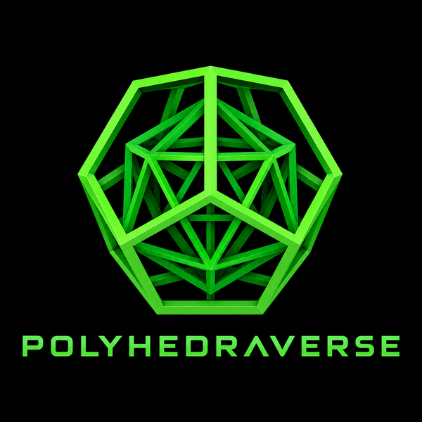

# Polyhedraverse

<p align="center">
  
</p>

**Open-source spatial geometry environment**

### Spatial Editing Suite
*Construct • Transform • Connect • Explore*

> An open-source spatial geometry environment for constructing,
> transforming, and interconnecting polyhedral forms in three dimensions.

A browser-based construction kit for convex polyhedra. Two ways to
connect pieces: click a free vertex and snap on a new piece with a free
rotational joint (molecular-model-kit style — started with the 8 convex
deltahedra specifically because they don't tile space and their dihedral
angles are incompatible across types), or click a free face and glue on
a shape with a matching face size for a real shared-face join (a cube
onto a cube, say), with a discrete rotational registration instead of a
free twist. A view toggle (Solid / Translucent / Inside view) lets you
see through a structure once pieces start nesting.

The intention is for this to grow into a sibling of
[Rhombiverse](https://github.com/DICTOR-Master/rhombiverse) — a general
polyhedral space-editing suite covering the Platonic and Archimedean
solids and the Johnson solid family alongside the 8 deltahedra, with its
own introductory geometric-packing puzzle game in the spirit of
Rhombiverse's RHOMBIS (working name: DELTIS). See `docs/build-plan.md`'s
trailing sections for what's actually shipped versus what's still ahead.

## Scope

- Platonic solids
- Archimedean solids
- Johnson solids
- Geometric transformations
- Spatial placement and orientation
- Lattice construction
- Interpenetrating structures
- Polyhedral relationships
- Concave (non-convex) polyhedra — may be added later, alongside the
  convex families above
- (room to grow) more unusual spatial operations as they're developed

This list is intentionally open-ended, describing the project's
direction rather than a feature checklist — so the README doesn't need
rewriting every time a new capability lands. **"What's here now" below
is the ground truth for what's actually shipped today**; Johnson solids
are in progress (71 of 92 so far), and lattice construction /
interpenetrating structures are still direction, not yet delivered.

## What's here now

The original 8-stage build plan (all 8 deltahedra, pick/attach/twist/
confirm, a real persisted assembly graph, the D10↔D12 rewrite rule,
cascade delete) is done — see `docs/build-plan.md` for the full
stage-by-stage account, including exactly how each stage was verified.
Since then:

- **Geometry core, restructured for multiple families**
  (`app/lib/polyhedra/`) — `core.ts` holds family-agnostic infrastructure
  (vertices+edges+faces as the only source of truth; everything else
  derived), with one file per family. D12 (snub disphenoid) is the one
  deltahedron with no compass-and-straightedge construction — its
  coordinates come from the positive real root of an irreducible cubic,
  hardcoded rather than solved at runtime.
- **Platonic solids added** — cube and dodecahedron (tetrahedron,
  octahedron, and icosahedron were already deltahedra D4/D8/D20).
  Cross-checked against a true 3D convex-hull computation, not
  hand-derived: an early attempt at the dodecahedron's face list, based
  on a plausible-looking heuristic, produced silently wrong, non-planar
  faces — see `docs/build-plan.md` for what that looked like and how it
  was actually fixed.
- **All 13 Archimedean solids** — cuboctahedron and the two truncated
  simple-integer solids first (low transcription risk), then the
  remaining 10 (golden-ratio coordinates, a truncated icosahedron derived
  by 1/3-edge-truncating this project's own icosahedron, and two chiral
  snub solids needing a numerically-solved root). Caught real
  transcription bugs building these, at more than one level — mismatched
  independently-generated vertex/edge orderings, a hand-guessed edge list,
  a mis-transcribed defining cubic for the snub cube's chiral constant
  (caught because it produced two different edge lengths instead of one),
  and a precision-rounding bug that broke a downstream verification
  script's tolerance without the shapes themselves being wrong — all
  worked examples in `docs/build-plan.md` of why every claim here gets a
  computational cross-check rather than trust.
- **71 of 92 Johnson solids so far**, in batches, each with a full
  postmortem in `docs/build-plan.md`. Batches 1-6 built the pyramids,
  cupolas, rotunda, and every elongated/gyroelongated/bicupola/
  augmented-prism form of them (34 shapes) — along the way, verifying
  rather than assuming the ortho/gyro twist angle (the triangular case
  coincides exactly with the already-registered cuboctahedron, the real
  reason "triangular gyrobicupola" isn't its own Johnson solid),
  catching a rounding-reused-as-computed-value precision bug, and
  confirming computationally (not guessed) that several gyroelongated
  shapes and both snub Archimedean solids are genuinely chiral — only
  one handedness of each is stored, which matters for face-attach (a
  mirror-image toggle is a real, not-yet-built gap this surfaced).
  Batch 7 added augmented dodecahedra and bidiminished/tridiminished
  icosahedra (6 shapes), deliberately excluding "augmented tridiminished
  icosahedron" (J64) once its natural construction was shown to be
  *provably* congruent to an already-registered shape. **Batch 8
  (augmented truncated Archimedean solids) is the most important
  methodological lesson in this registry so far**: 6 of 7 attempted
  shapes passed every check used through batch 7 (Euler's formula,
  uniform edge length) and were still wrong — some of their "extra"
  merged quad faces turned out to be rhombi (unit edges, unequal
  diagonals) rather than true squares, caught only by
  `verify:face-attach`/`verify:face-twist`'s stricter cross-shape
  tolerance. Only J65 survived; J66-J71 were reverted rather than
  shipped wrong. **Edge-length uniformity alone doesn't confirm a face
  is regular** — a rhombus and a square can have identical edges — and
  every batch since checks face diagonals explicitly, not just edges.
  Batch 9 (gyrate/diminished rhombicosidodecahedra, 11 of 12 attempted
  shapes) applied that discipline from the start and passed cleanly on
  the first attempt, on a much larger, more combinatorially complex
  family; only J79 (bigyrate diminished) was left out after failing
  identically across all 10 possible constructions. 5 of the 92 are
  already deltahedra in this registry (D6/D10/D12/D14/D16) and aren't
  re-derived. J64, J66-J71, and J79 all stay genuinely unresolved and
  documented, not silently missing; the remaining ~21 shapes with no
  closed form at all are the last stretch, requiring real numerical
  optimization rather than the closed-form constructions used so far.
  First shape in this registry that isn't vertex-transitive: J1's apex
  has degree 4 while its base vertices have degree 3. First with no
  degree-3 vertex at all: J10 (only degree 4 and 5).
- **Pick, attach, twist, confirm/cancel** — hover a vertex to see its
  capacity, pick a shape to attach, drag to twist it around the one
  remaining rotational degree of freedom, then confirm or cancel.
- **A real assembly graph** (`app/lib/assembly.ts`), built only from
  user actions and persisted through an API route
  (`app/api/assemblies/`) — reload restores exactly what you built.
- **The D10↔D12 rewrite rule** — swap a placed node's shape in place;
  existing connections re-anchor to the most directionally-similar
  vertex on the new shape where one exists, or get flagged rather than
  guessed.
- **Cascade delete**, a capacity glow so you can see at a glance which
  nodes still have room to build from, and a (currently unreachable,
  honestly documented) cycle-detection primitive for a future "closed
  cage" goal.
- **Face-to-face connections** — click a free face (not just a vertex)
  to glue on a shape with a matching face size. Two coincident regular
  n-gon faces have no free rotation the way a vertex ball-joint does —
  only *n* discrete registrations keep them flush — so dragging a
  pending face-attach cycles through those instead of spinning freely.
  Getting the placement math right took a real wrong turn worth reading
  about in `docs/build-plan.md`: assuming "no extra twist" or "a
  multiple of 360°/n from zero" is already correct turned out false for
  most shape pairs: the fix was computing the angle analytically instead
  of guessing.
- **A view toggle** (Solid / Translucent / Inside view) for seeing
  through a structure once pieces start nesting — applies to every
  placed shape at once.
- **PolyhedralWheel** — a dodecahedron-shaped 3D radial menu (`Tab` /
  `Space`, or the always-visible corner medallion, to open) replacing the
  flat shape-picker button row, which doesn't scale to 100+ shapes.
  Family-grouped (deltahedra/Platonic/Archimedean/Johnson), ported from
  Rhombiverse's Rhombic Wheel with its own green color identity rather
  than a straight reskin (a small silver corner medallion,
  `CornerHudWheel`, is the one piece that stays silver, matching
  Rhombiverse's own equivalent). Also filters to compatible shapes when
  picking a face-attach target. Actions (augment/diminish) and
  Spherical/X-Ray view modes are still deferred — see
  `docs/build-plan.md`'s own sections for the full design record.

## Structure

```
polyhedraverse/
  app/
    lib/
      polyhedra/
        core.ts          # family-agnostic infra: PolyhedronSpec, makeSpec, validateShape, triangulateFace, buildFaceConnectors
        deltahedra.ts    # the 8 deltahedra, verified against a convex hull
        platonic.ts      # cube + dodecahedron (the 2 Platonic solids not already deltahedra)
        archimedean.ts   # all 13 Archimedean solids
        johnson.ts       # first batch of 6 Johnson solids (87 more to go)
        rewrite.ts       # D10<->D12 vertex-matching (pure function, no three.js)
        index.ts         # combined POLYHEDRA / POLYHEDRON_IDS across every family
      assembly.ts        # the real {nodes, connections} graph + validation (vertex- and face-kind)
      graph.ts           # subtree/cycle graph logic (pure, no three.js)
    components/
      ShapeViewer.tsx    # the whole Three.js scene: render, pick, attach/face-attach, twist, rewrite, delete, view modes
    api/assemblies/      # GET/POST persistence route (local JSON for now; see docs)
    page.tsx             # UI shell around ShapeViewer
  scripts/               # validate-*, verify-attach/twist/rewrite/graph/face-* -- run outside the browser
  tests/e2e/             # permanent Playwright suite (npm run test:e2e)
  docs/
    build-plan.md               # the build plan, with how each stage was verified
    construction-kit-spec.md    # the vertex-snapping design law + extensibility notes
    vercel-deployment-plan.md   # planned repo/Vercel layout once this deploys
  playwright.config.ts
```

## Design documents (`docs/`)

Read `docs/build-plan.md` first — the stage-by-stage build order, and,
for each stage, what was actually verified and how (geometry-math
scripts, direct API calls, and eventually a real-browser Playwright
pass) rather than assumed. `docs/construction-kit-spec.md` has the
underlying design law (vertex-snapping, not face-gluing; derive
connector data from vertices + edges, never hand-declare it
separately). `docs/vercel-deployment-plan.md` records the intended
repo/Vercel layout for when this deploys alongside Rhombiverse.

## Contributing

Humans and AI coding agents are both welcome to open PRs — see
`CONTRIBUTING.md` for how this project actually works and
`CODE_OF_CONDUCT.md` for the community standard.

## Running locally

```
npm install
npm run dev
```

Then open `http://localhost:3000`. `npm run lint`, `npx tsc --noEmit`,
and the `verify:*` scripts (`npm run verify:attach`, etc.) all run
without a browser; `npm run test:e2e` needs Chromium
(`npx playwright install --with-deps chromium`) on whatever machine
runs it.

The primary dev machine is a Raspberry Pi (arm64) — fine for everything
above, but Playwright's Chromium download is slow and occasionally
stalls there. Where a second machine is available (`dicto-node` on the
LAN, reachable over SSH with Chromium already installed), it's worth
using for `npm run test:e2e` and other browser-dependent runs rather
than waiting on the Pi.
